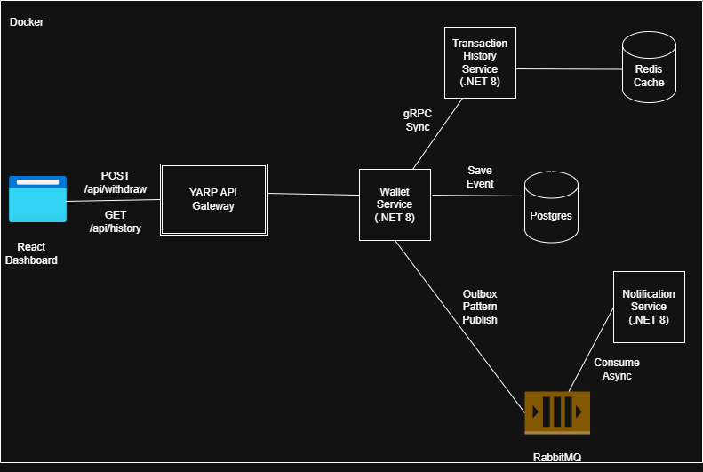

## Architecture

- **WalletService** — .NET 8 Web API, Marten event sourcing on PostgreSQL, `POST /api/withdraw`, and a Marten-backed transactional outbox.
- **YarpGateway** — YARP reverse proxy with a fixed-window rate limiter on withdrawals.
- **NotificationService** — .NET 8 Worker + MassTransit/RabbitMQ consumer that logs `Notification Sent`.
- **TransactionHistoryService** — .NET 8 Web API + gRPC server. Redis stores the flattened wallet read model and recent transactions.
- **React dashboard** — triggers withdrawals and immediately refreshes history after the synchronous gRPC projection succeeds.
- **Docker Compose** — Postgres, RabbitMQ, Redis, all three backend services, YARP, and the React app.



[View the Axiom Ledger Entity Relationship Diagrams (PDF)](./axion-ledger-erds.pdf)

## Run everything

```bash
docker compose up --build
```
