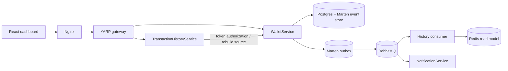

# Axiom Ledger

A small event-sourced wallet system built around a single source of truth in Postgres, a durable transactional outbox, RabbitMQ, and a versioned Redis read model.

## Architecture



The event store is authoritative. Redis is only a query/read model and can be rebuilt from the event stream.

## Ledger guarantees

- A new wallet starts at `0.00` and can only spend money that has been credited.
- Deposits and withdrawals are separate domain events.
- Wallet currency is fixed at creation time; a ZAR wallet cannot be debited in USD.
- All money crossing service boundaries remains `decimal`; Redis stores the monetary value as an invariant-culture string.
- Withdrawals require `X-Wallet-Token` and an `Idempotency-Key`.
- Concurrent writes use Marten's optimistic stream concurrency through `FetchForWriting()` and retry once against the latest state.
- The HTTP response represents the Postgres commit. Redis projection is asynchronous, so a successful write is never turned into a false 503 because the read model is temporarily unavailable.
- History projection is idempotent and version-aware. Duplicate events are harmless, and late events cannot roll an already newer balance backwards.
- Recent transactions are stored in a Redis sorted set by ledger version rather than arrival order.
- A local admin rebuild endpoint can reconstruct Redis from the authoritative event stream.
- YARP rate limits wallet mutation endpoints per forwarded client IP.

## API

`POST /api/wallets`

Creates a wallet and returns a one-time wallet access token. Wallet creation does not require an idempotency key because the response contains the newly generated wallet credentials; financial commands use idempotency keys instead.

```json
{
  "currency": "ZAR"
}
```

`POST /api/deposit`

Requires:

- `X-Wallet-Token`
- `Idempotency-Key`

```json
{
  "walletId": "<guid>",
  "amount": 100,
  "currency": "ZAR"
}
```

`POST /api/withdraw`

Uses the same headers and body. Withdrawals are rejected when the requested amount exceeds the current balance.

`GET /api/history?walletId=<guid>`

Requires `X-Wallet-Token` and returns the current Redis read model.

## Rebuilding Redis

The history service is bound to `127.0.0.1:5102` for local administration.

For one wallet:

```bash
curl -X POST http://localhost:5102/internal/rebuild/<wallet-id>
```

For every wallet:

```bash
curl -X POST http://localhost:5102/internal/rebuild-all
```

Run a rebuild while you are not actively mutating the wallet(s), then let the RabbitMQ consumer resume normal projection afterwards.

## Run

For a clean run after the pre-fix demo, reset the old Docker volumes once because the original version had no wallet credentials and could write negative balances:

```bash
docker compose down -v
docker compose up --build
```

Open `http://localhost:3000`.

The first page load creates a wallet automatically. Use **Add funds** before **Withdraw**.

## Tests

```bash
dotnet test Axiom.Ledger.sln
```

The tests cover the core balance, insufficient-funds, and currency invariants. Database-level concurrency should also be exercised with the Docker stack when validating deployment behaviour.

## Notes

`AutoCreate.All` is intentionally used for this development/demo repository so a fresh Postgres volume can bootstrap itself. A production deployment should replace that with a reviewed migration workflow and real secret management.
